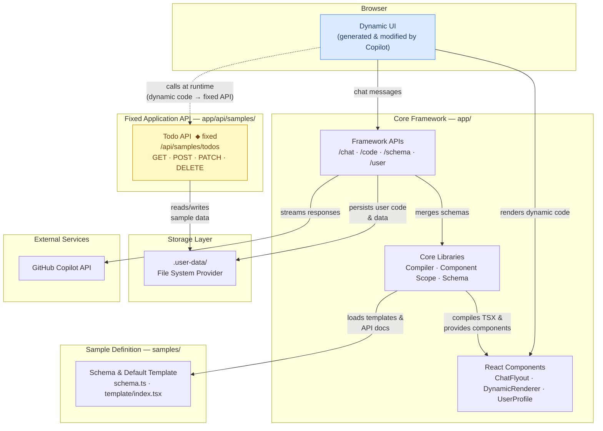

# Dynamic UI with GitHub Copilot SDK

A demonstration application showcasing the **GitHub Copilot SDK** for building AI-powered, dynamically updating user interfaces. Users can chat with GitHub Copilot to modify the UI in real-time through natural language commands.

  

## Overview

This application demonstrates a **two-layer architecture** that cleanly separates concerns:

### Core Framework (`app/`)
Stable infrastructure that powers the dynamic UI system:
- Chat integration with GitHub Copilot
- In-browser TypeScript compilation
- User management and storage
- Sandboxed UI component library

### Sample Applications (`samples/`)
Swappable demo apps that showcase the framework:
- UI templates (what users can modify)
- Sample-specific API schemas
- Self-contained and easily replaceable

Users interact with GitHub Copilot through a chat interface to request UI changes like "make the header blue" or "add a priority field to todos". Copilot generates new React/TypeScript code that is compiled and rendered instantly in the browser.

### Key Features

- **AI-Powered UI Modifications** - Chat with Copilot to change the UI
- **Instant Compilation** - In-browser TypeScript/JSX compilation using Sucrase
- **Multi-User Support** - Each user has their own code sandbox
- **Persistent Storage** - User code persists across sessions
- **Syntax Highlighting** - View generated code with proper highlighting
- **Reset Capability** - Restore to default template anytime

## Prerequisites

- **Node.js** 18.x or higher
- **npm** 9.x or higher
- **GitHub Copilot** subscription with API access

## Authentication Setup

The application uses the GitHub Copilot SDK which requires authentication. You have two options:

### Option 1: GitHub Copilot CLI Login (Recommended)

The simplest approach is to authenticate using the GitHub Copilot CLI:

1. **Install the Copilot CLI** (if not already installed):
   ```bash
   npm install -g @github/copilot
   ```

2. **Launch the CLI and login**:
   ```bash
   copilot
   ```

3. **Use the `/login` command** within the CLI and follow the browser-based authentication flow.

Once logged in, your credentials are stored securely, and this application will automatically use them.

### Option 2: Personal Access Token via Environment Variable

Alternatively, you can authenticate using a GitHub Personal Access Token (PAT):

1. **Create a fine-grained PAT** at [github.com/settings/personal-access-tokens/new](https://github.com/settings/personal-access-tokens/new)

2. **Add the "Copilot Requests" permission**:
   - Under "Permissions", click "Add permissions"
   - Select **"Copilot Requests"**

3. **Generate and copy the token**

4. **Create a `.env.local` file** in the project root:
   ```env
   GH_TOKEN=ghp_your_token_here
   ```
  

### Verifying Authentication

When the application starts, it will log the authentication status:
- ✅ `Authenticated as: <username> via <auth-type>` - You're good to go!
- ❌ `Not authenticated...` - Check your CLI login or token configuration

## Getting Started

### 1. Clone and Install

```bash
git clone <repository-url>
cd src
npm install
```

### 2. Configure Authentication

Follow the [Authentication Setup](#authentication-setup) section above to configure your credentials.

### 3. Run the Development Server

```bash
npm run dev
```

Open [http://localhost:3000](http://localhost:3000) in your browser.

### 4. Start Chatting

1. Click the **"Customize with Copilot"** button in the bottom-right corner
2. Ask Copilot to modify the UI (e.g., "Add a dark mode toggle")
3. Watch the UI update instantly!

## Project Structure

```
├── app/                    # CORE FRAMEWORK (fixed)
│   ├── api/               
│   │   ├── chat/          # Copilot chat endpoint
│   │   ├── code/          # User code storage CRUD
│   │   ├── schema/        # Component schema (merges core + sample)
│   │   ├── user/          # User management
│   │   └── samples/       # Sample app APIs
│   │       └── todos/     # Todo sample API
│   │
│   ├── components/        # React UI components
│   │   ├── ChatFlyout.tsx
│   │   ├── DynamicRenderer.tsx
│   │   └── UserProfile.tsx
│   │
│   ├── contexts/          # React contexts
│   │   └── UserContext.tsx
│   │
│   ├── lib/               # Core utilities
│   │   ├── compiler.ts    # Sucrase-based compiler
│   │   ├── component-scope.ts # UI components for dynamic code
│   │   ├── schema.ts      # Core component schemas
│   │   └── storage.ts     # Storage abstraction
│   │
│   ├── layout.tsx
│   └── page.tsx
│
└── samples/                # SAMPLE APPLICATIONS (swappable)
    └── startup-app/
        ├── template/      # Default UI code
        │   ├── index.tsx
        │   └── manifest.json
        ├── schema.ts      # Sample API schema
        └── README.md
```

### Core vs Sample Separation

This architecture makes it easy to create new sample applications without touching the core framework.

| Layer | Location | Contains | Modify when... |
|-------|----------|----------|----------------|
| **Core** | `app/lib/schema.ts` | UI component definitions | Adding new UI primitives |
| **Core** | `app/lib/component-scope.ts` | Sandboxed components | Implementing new components |
| **Core** | `app/api/` | Framework APIs (chat, code, user) | Changing framework behavior |
| **Sample** | `samples/*/schema.ts` | API endpoint documentation | Adding sample-specific APIs |
| **Sample** | `samples/*/template/` | Default user code | Changing starter UI |
| **Sample** | `app/api/samples/*/` | Sample API implementations | Adding sample endpoints |

The `/api/schema` endpoint automatically merges core component schemas with sample API schemas, providing Copilot with complete context.

## Architecture

### Layer Diagram



> **Key insight:** The UI layer is **dynamic** — Copilot regenerates it on every chat interaction. The Application API (e.g. `/api/samples/todos`) is **fixed** — it provides a stable contract that the dynamic UI code calls at runtime via `fetchAPI`.

### How It Works

1. **User Request**: User types a modification request in chat
2. **Copilot Processing**: Request is sent to GitHub Copilot with schema context
3. **Code Generation**: Copilot generates new React/TypeScript code
4. **Compilation**: Sucrase compiles the code in-browser (~5ms)
5. **Rendering**: DynamicRenderer executes and displays the component
6. **Persistence**: Code is saved to user's storage

### Component Scope

Dynamic code has access to a sandboxed set of UI components:

| Component | Description |
|-----------|-------------|
| `Button` | Styled button with variants |
| `Card` | Container with shadow and padding |
| `Input` | Text input field |
| `Select` | Dropdown select |
| `Checkbox` | Checkbox input |
| `Badge` | Status/label badge |
| `List` / `ListItem` | List containers |
| `Header` | Section headers |
| `Spinner` | Loading indicator |
| `Flex` | Flexbox layout helper |
| `fetchAPI` | Fetch wrapper for API calls |

### Schema System

The `/api/schema` endpoint **merges two schema sources**:

1. **Core Schema** (`app/lib/schema.ts`)
   - UI components available to dynamic code
   - Component props and types
   - React hooks (useState, useEffect, etc.)

2. **Sample Schema** (`samples/startup-app/schema.ts`)
   - Sample-specific API endpoints
   - Request/response formats
   - Data models

This separation allows you to swap sample applications without modifying core framework code.

## Enhancing the Starter App

### Adding New UI Components

1. Add your component to `app/lib/component-scope.ts`:

```tsx
function MyComponent({ title, onClick }: { title: string; onClick?: () => void }) {
  return (
    <div className="p-4 bg-blue-100 rounded" onClick={onClick}>
      {title}
    </div>
  );
}
```

2. Export it in the `componentScope` object:

```tsx
export const componentScope = {
  // ... existing components
  MyComponent,
};
```

3. Update the schema in `app/lib/schema.ts`:

```tsx
{
  name: "MyComponent",
  description: "A custom component for...",
  props: [
    { name: "title", type: "string", required: true },
    { name: "onClick", type: "() => void", required: false },
  ],
}
```

### Adding New API Endpoints

1. Create a new route in `app/api/samples/your-endpoint/route.ts`

2. Add the endpoint to the sample schema in `samples/startup-app/schema.ts`:

```tsx
{
  path: "/api/samples/your-endpoint",
  method: "GET",
  description: "What this endpoint does",
  response: { /* response shape */ },
}
```

### Modifying the Default Template

Edit `samples/startup-app/template/index.tsx` to change what users see initially. This template is loaded for new users or when they reset.

### Adding Multiple Files to Templates

1. Add new files to `samples/startup-app/template/`
2. Update `samples/startup-app/template/manifest.json`:

```json
{
  "name": "My Template",
  "version": "1.0.0",
  "entrypoint": "index.tsx",
  "files": ["index.tsx", "components.tsx", "utils.ts"]
}
```

### Creating a New Sample Application

Follow these steps to add a new sample application:

#### 1. Create the sample folder structure

```
samples/
└── your-app/
    ├── template/
    │   ├── index.tsx       # Default UI code
    │   └── manifest.json   # Template metadata
    ├── schema.ts           # API schema for Copilot
    └── README.md           # Sample documentation
```

#### 2. Create the schema file (`samples/your-app/schema.ts`)

```typescript
import { APIEndpoint } from "@/app/lib/schema";

export const sampleName = "your-app";
export const sampleDescription = "Description of your sample app";

export const apiEndpoints: APIEndpoint[] = [
  {
    path: "/api/samples/your-endpoint",
    method: "GET",
    description: "What this endpoint does",
    parameters: [],
    response: { type: "{ data: YourType[] }", description: "Response description" },
  },
];

export const dataTypes = `
interface YourType {
  id: string;
  // ... your fields
}
`;

export function generateApiDocumentation(): string {
  let doc = `## ${sampleDescription}\n\n### API Endpoints\n\n`;
  for (const api of apiEndpoints) {
    doc += `#### ${api.method} ${api.path}\n${api.description}\n\n`;
  }
  doc += "### Data Types\n\n```typescript\n" + dataTypes + "```\n";
  return doc;
}
```

#### 3. Register the schema (`app/lib/schema-registry.ts`)

```typescript
import * as yourAppSchema from "@/samples/your-app/schema";

const schemaRegistry: Record<string, SampleSchema> = {
  "startup-app": todoAppSchema,
  "your-app": yourAppSchema,  // Add your sample here
};
```

#### 4. Add API routes (`app/api/samples/your-endpoint/route.ts`)

Create your API route handlers following the existing todos pattern.

#### 5. Set the active sample

In `.env.local`:
```env
SAMPLE_NAME=your-app
```

Or run with:
```bash
SAMPLE_NAME=your-app npm run dev
```

## Storage

User data is stored in `.user-data/` directory:

```
.user-data/
└── {userId}/
    ├── user.json       # User metadata
    ├── bundle.json     # Code bundle metadata
    └── files/
        └── index.tsx   # User's code files
```

The storage layer (`app/lib/storage.ts`) uses a provider abstraction that can be extended to support:
- Git-based storage (branch per user)
- Database storage
- Cloud storage (S3, Azure Blob, etc.)

## Scripts

| Command | Description |
|---------|-------------|
| `npm run dev` | Start development server |
| `npm run build` | Build for production |
| `npm run start` | Start production server |
| `npm run lint` | Run ESLint |

## Tech Stack

- **Framework**: Next.js 16.1 (App Router)
- **Language**: TypeScript
- **Styling**: Tailwind CSS 4
- **AI**: GitHub Copilot SDK
- **Compilation**: Sucrase (in-browser)
- **Syntax Highlighting**: react-syntax-highlighter

## Future Enhancements

- [ ] Git integration for version control per user
- [ ] Checkpoint/rollback system
- [ ] Multi-page dynamic applications
- [ ] Real authentication (OAuth, etc.)
- [ ] Collaborative editing

## License

MIT
